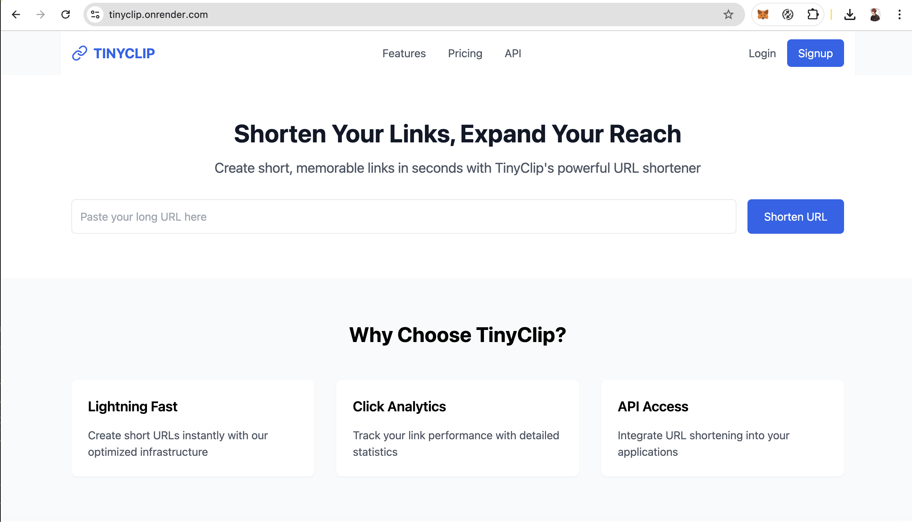

# TinyClip - URL Shortener

A modern URL shortening service built with the MERN stack (MongoDB, Express.js, React.js, Node.js). Create shortened URLs quickly and track their usage with a clean, responsive interface.



## Features

- 🔗 Shorten long URLs instantly
- 📊 Track clicks on shortened URLs
- 🎯 Custom short URL codes using nanoid
- 💨 Fast redirection
- 📱 Responsive design
- ⚡ Real-time URL validation

## Live Demo

[Visit TinyClip](https://tinyclip.onrender.com/)

## Tech Stack

- **Frontend**: React.js with Tailwind CSS
- **Backend**: Node.js & Express.js
- **Database**: MongoDB
- **Deployment**: Render

## Prerequisites

Before you begin, ensure you have the following installed:
- [Node.js](https://nodejs.org/) (v14 or higher)
- [MongoDB](https://www.mongodb.com/try/download/community)
- [npm](https://www.npmjs.com/) or [yarn](https://yarnpkg.com/)

## Installation

1. Clone the repository:
```bash
git clone https://github.com/your-username/url-shortener.git
cd url-shortener
```

2. Install backend dependencies:
```bash
npm install
```

3. Install frontend dependencies:
```bash
cd client
npm install
```

4. Create a `.env` file in the root directory:
```env
PORT=8000 (or any other port you want)
MONGODB_URL=your_mongodb_connection_string
NODE_ENV=development
```

## Running Locally

1. Start the backend server:
```bash
# From the root directory
node server.js
```

2. Start the frontend development server:
```bash
# From the client directory
npm start
```

3. Visit [http://localhost:3000](http://localhost:3000) in your browser

## API Endpoints

### POST /api/shorten
Creates a shortened URL
```javascript
{
  "longUrl": "https://example.com/very/long/url"
}
```

### GET /:code
Redirects to the original URL

## Project Structure
```
tinyclip/
├── server.js          # Backend entry point
├── package.json       # Backend dependencies
├── .env              # Environment variables
├── client/           # Frontend directory
│   ├── src/
│   │   ├── components/
│   │   │   ├── Main.js
│   │   │   └── Navbar.js
│   │   ├── App.js
│   │   └── index.js
│   └── package.json  # Frontend dependencies
└── README.md
```

## Deployment

The application can be deployed using Render:

1. Create a new Web Service on Render
2. Connect your GitHub repository
3. Configure the service:
   - Name: tinyclip
   - Environment: Node
   - Build Command: `npm install && npm run build`
   - Start Command: `npm start`
4. Add environment variables in Render dashboard
5. Deploy!

## Contributing

1. Fork the repository
2. Create a new branch: `git checkout -b feature-name`
3. Make your changes
4. Commit: `git commit -m 'Add feature'`
5. Push: `git push origin feature-name`
6. Submit a Pull Request

## License

This project is licensed under the MIT License - see the [LICENSE](LICENSE) file for details.

## Acknowledgments

- [nanoid](https://github.com/ai/nanoid) for generating unique URL codes
- [Tailwind CSS](https://tailwindcss.com/) for the styling
- [Express.js](https://expressjs.com/) for the backend framework
- [React](https://reactjs.org/) for the frontend framework


Project Link: [https://github.com/ash413/url-shortener.git/](https://github.com/ash413/url-shortener.git)